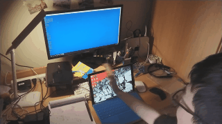

# Gesture Wave



A hand-gesture recognition system using Doppler effect of ultrasonic.

Using SVM as a classifier to recognize your gesture sound wave.

You can define your own gesture to train though accuracy is not guaranteed.

You can also define many key combo of your own to have fun.

## Setup & Run

Note: **Windows** platform only. Performance on python2 is not guaranteed.

* run './Set_env.bat' to add some necessary package to your python environment. 

* Due to some technical problem, we can't properly import any wave generator lib on Windows. Before running our python codes, you to setup an external sound wave generator, set the parameters in accord with codes configuration in `config/personal.cfg`.  We use [Online Tone Generator](http://www.szynalski.com/tone-generator/) as our wave generator.

* simply run 

  ```python src/detectGesture.py``` 

* some options you can input when running `detectGesture.py` :
  * `g`: open a GUI interface which can help you record  gesture wave for training.
  * `t`: training a SVM using selected data.
  * `v`: validating SVM
  * `r`: a recording toggle
  * `m`: change keyboard mapping.

Have fun with it! ☺☺☺
